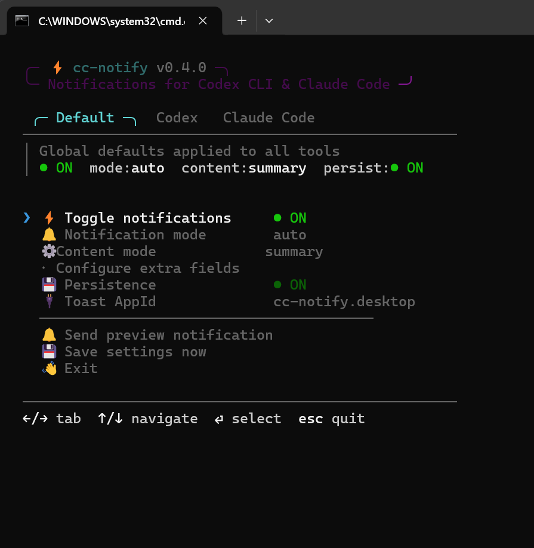
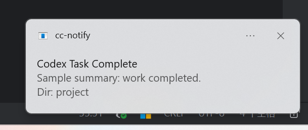

# ⚡ cc-notify

**为 [Codex CLI](https://github.com/openai/codex) 和 [Claude Code](https://docs.anthropic.com/en/docs/claude-code) 提供 Windows 桌面通知。**

当 Codex 或 Claude Code 完成任务时，即使终端在后台，也能收到 toast 通知或弹窗提醒。

## 功能特性

- 🔔 **Windows toast 通知** — 支持回退到弹窗对话框
- 🎛️ **分工具设置** — Codex 和 Claude Code 可以独立配置
- ⚡ **Tab 切换式交互 UI** — 在 Default / Codex / Claude Code 标签页间切换
- 📋 **内容模式** — 摘要、完整消息或极简 "complete" 文本
- 💾 **持久化设置** — 偏好设置跨重启保存
- 🔌 **一键安装** — 自动为两个工具配置 hook

## 快速开始

### 方式 A：下载 Release

1. 从 [Releases](https://github.com/anthropics/cc-notify/releases) 下载最新版本
2. 解压后双击 `install.cmd`
3. 完成 — Codex CLI 和 Claude Code 的通知已启用

### 方式 B：从源码构建

```powershell
git clone https://github.com/anthropics/cc-notify.git
cd cc-notify
go build -o dist/cc-notify.exe ./cmd/cc-notify
./dist/cc-notify.exe install
```

## 使用方法

```
cc-notify                              交互式设置界面
cc-notify install [codex|claude]       注册 hook（不指定则两个都装）
cc-notify uninstall [codex|claude]     移除 hook（不指定则两个都删）
cc-notify notify <json>                处理 Codex 事件载荷
cc-notify notify --claude              处理 Claude Code hook（从 stdin 读取）
cc-notify notify --file <path>         从文件读取载荷
cc-notify notify --b64 <base64>        base64 编码的载荷
cc-notify test-notify [title] [body]   发送测试通知
cc-notify test-toast [title] [body]    测试 toast 模式
cc-notify help                         显示帮助
```

## 交互式 UI

直接运行 `cc-notify`（不加参数）打开交互式控制中心：



**标签页：**
- **Default** — 全局默认设置，被所有工具继承
- **Codex** — 仅 Codex CLI 的覆盖设置（模式/内容/开关）
- **Claude Code** — 仅 Claude Code 的覆盖设置（模式/内容/开关）

每个工具标签页可以设为 `inherit`（继承 Default）或者设置独立的模式和内容。例如你可以让 Codex 用 toast 通知，Claude Code 用弹窗。

## 通知模式

| 模式 | 说明 |
|------|------|
| `auto` | 先尝试 toast，失败则回退到弹窗 |
| `toast` | Windows 系统通知（需要开始菜单快捷方式） |
| `popup` | 始终使用弹窗对话框 |

## 内容模式

| 模式 | 说明 |
|------|------|
| `summary` | 简短摘要 |
| `full` | 完整的助手回复消息 |
| `complete` | 极简的 "complete" 文本 |

## 工作原理

### Codex CLI
在 `~/.codex/config.toml` 中注册 `notify` 命令。当 Codex 完成任务时，调用 `cc-notify notify <json>` 发送事件载荷。

### Claude Code
在 `~/.claude/settings.json` 中注册 `Stop` hook。当 Claude Code 完成时，通过 stdin 将 hook 载荷传给 `cc-notify notify --claude`。

## 配置文件

设置保存在 `%LOCALAPPDATA%\cc-notify\settings.json`：

```json
{
  "enabled": true,
  "persist": true,
  "mode": "auto",
  "content": "summary",
  "include_dir": true,
  "include_model": false,
  "include_event": false,
  "toast_app_id": "cc-notify.desktop",
  "codex_mode": "",
  "codex_content": "",
  "claude_mode": "popup",
  "claude_content": "full"
}
```

分工具字段（`codex_mode`、`claude_mode` 等）覆盖全局默认值。空字符串表示继承 Default。

## 环境变量

| 变量 | 说明 |
|------|------|
| `CC_NOTIFY_MODE` | 覆盖通知模式（`auto`/`toast`/`popup`） |
| `CC_NOTIFY_TOAST_APP_ID` | 覆盖 toast Application User Model ID |
| `CC_NOTIFY_NO_PAUSE` | 设为 `1` 禁用 Windows 上的 "Press Enter to exit" |

## 卸载

```powershell
cc-notify uninstall
```

或者双击 release 文件夹中的 `uninstall.cmd`。

## 许可证

[MIT](LICENSE)

